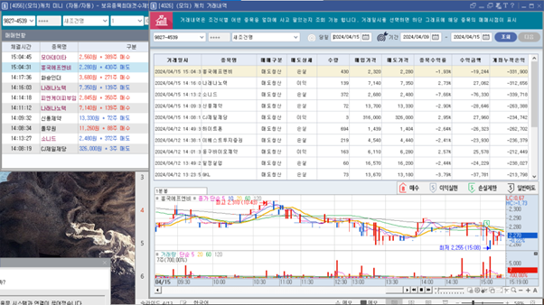

팀원인 윤승규 학생이 이베스트투자 HTS에서 이용한 조건식을 영웅문에 옮겨 모의매매를 해 보려는 시도가 있었고, 항목 중 ‘Bollinger Bands 근접’ 조건이 이베스트에서는 음수 값이 입력이 되는데에 반해 영웅문에서는 0부터 100까지만 입력 가능했습니다. 이베스트와 이 조건으로 비교해 본 결과 검색되는 종목이 많은 차이가 있었습니다. 이 부분을 보완할 다른 조건식을 추가할 방안이 필요했습니다.

주가 이동평균 배열의 서식이 달랐습니다. 이베스트에서는 종가 기준을 두고 이평이 역배열임을 명시할 수 있는 반면 영웅문은 배열 개수를 지정할 수 있지만 배열의 형태는 지정할 수 없었습니다. 찾아본 결과 배열값에 따라 역배열/정배열이 정해지지만 영웅문에서는 이를 따로 명시해주지 않았기 때문이었습니다. 또한 영웅문에서는 일목균형표 기준선 비교 내에 종가 기준과 n봉 지속 조건을 붙일 수 없었는데, 이베스트에서의 ‘상태 n봉 지속’ 조건이 단순히 n회 이상으로 통일되어있는 듯했습니다.

또한 영웅문은 이베스트와 달리 이동평균이격도 조건에서 시가/종가 등 컨디션 추가가 가능했고, 양 측을 번갈아 보면 헷갈릴 수 있다고 생각했습니다. 조건식의 세세한 항목 하나하나까지 구현이 되어있지만, 투자에 관해 전혀 모르는 사람이 인터넷을 보고 따라하기에도 내용을 제대로 숙지하기 어려운 느낌이 있습니다.

주문시간 종료 (2024.04.08 15:18) 

매매 기준 정보 출력 화면

2024.04.12 기준 기록

2024.04.15 최종 결과, 1천만 원을 시작으로 손실액 자체는 크지 않지만 많은 종목에서 손실을 입었습니다. 매수할 종목을 선택하는 알고리즘에 문제가 있거나 매수/매도 타이밍 설정에 하자가 있었던 것으로 추정됩니다.

한번 자동매매를 시작하면 일정 시간 동안은 자동으로 돌아가지만 다음날 다시 켜줘야 하는 번거로움이 있지만, 이것이 꼭 필요한 기능인지 아닌지는 아직 의문이 듭니다. 손실 방지를 -2.5%로 설정했지만 아침에 켜 보면 자동매매가 중지되어있고, 이 시간동안 매도하지 못해 막지 못한 손실도 발생했기 때문입니다. 모의매매와 실전매매에서 차이가 있을지도 모르겠습니다.